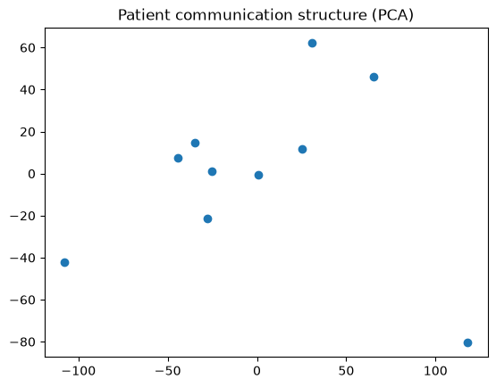
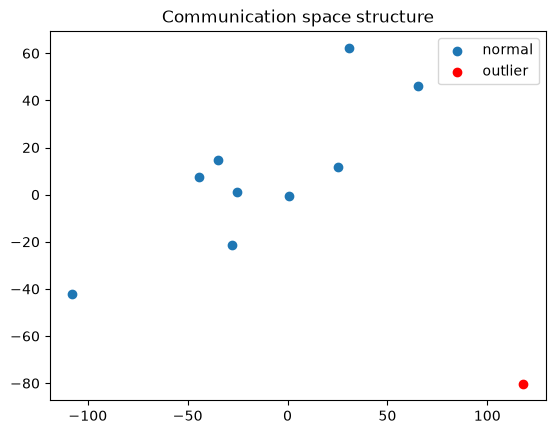
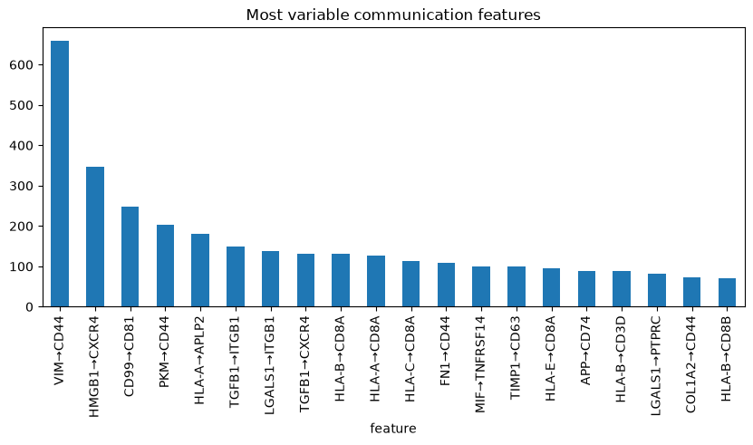
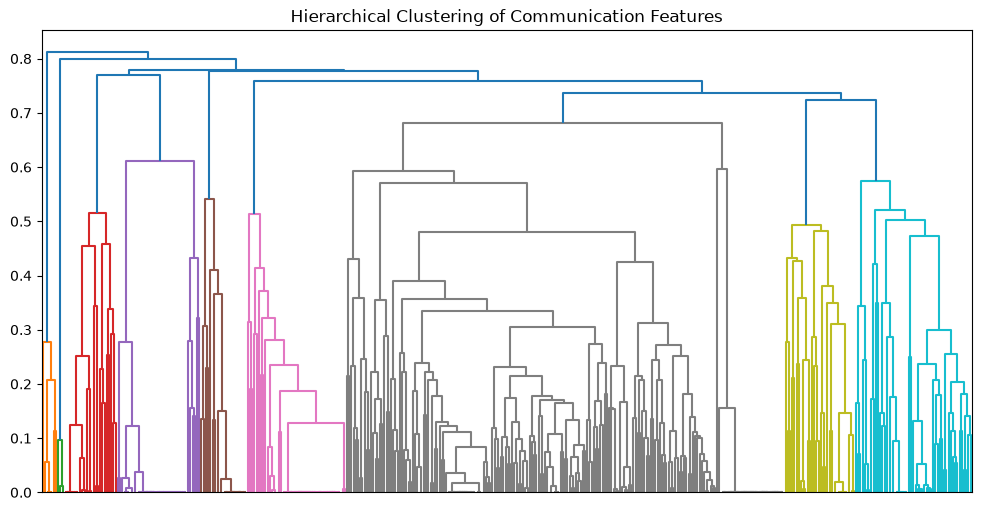

""""
Load integrated single-cell breast cancer atlas in backed mode for memory efficiency.
Subset data to a single donor for feasibility testing of CCC pipeline.
Standardize gene names and ensure uniqueness for downstream compatibility.
Normalize and log-transform expression matrix.
Aggregate expression at cell-type level.
Load curated ligand–receptor interaction database (consensus set).
Compute ligand–receptor communication scores using aggregated expression.
Generate ranked cell–cell communication interaction table.
Output used for downstream feature engineering and ML modeling
"""

import warnings
warnings.filterwarnings("ignore")

import scanpy as sc

adata = sc.read_h5ad(
    r"C:\BRCA\BRCA Project\data\IntegratedAtlas.h5ad",
    backed="r"
)
adata

    AnnData object with n_obs × n_vars = 621200 × 37389 backed at 'C:\\BRCA\\BRCA Project\\data\\IntegratedAtlas.h5ad'
        obs: 'tissue_ontology_term_id', 'tissue_type', 'assay_ontology_term_id', 'disease_ontology_term_id', 'cell_type_ontology_term_id', 'self_reported_ethnicity_ontology_term_id', 'development_stage_ontology_term_id', 'sex_ontology_term_id', 'donor_id', 'suspension_type', 'grade', 'author_cell_type', 'batch', 'is_primary_data', 'cell_type', 'assay', 'disease', 'sex', 'tissue', 'self_reported_ethnicity', 'development_stage', 'observation_joinid'
        var: 'feature_is_filtered', 'feature_name', 'feature_reference', 'feature_biotype', 'feature_length', 'feature_type'
        uns: 'batch_condition', 'citation', 'default_embedding', 'is_pre_analysis', 'organism', 'organism_ontology_term_id', 'schema_reference', 'schema_version', 'title'
        obsm: 'X_rpca', 'X_umap'

donor = adata.obs["donor_id"].unique()[0]
adata_p = adata[adata.obs["donor_id"] == donor].to_memory()

adata_p

    AnnData object with n_obs × n_vars = 6176 × 37389
        obs: 'tissue_ontology_term_id', 'tissue_type', 'assay_ontology_term_id', 'disease_ontology_term_id', 'cell_type_ontology_term_id', 'self_reported_ethnicity_ontology_term_id', 'development_stage_ontology_term_id', 'sex_ontology_term_id', 'donor_id', 'suspension_type', 'grade', 'author_cell_type', 'batch', 'is_primary_data', 'cell_type', 'assay', 'disease', 'sex', 'tissue', 'self_reported_ethnicity', 'development_stage', 'observation_joinid'
        var: 'feature_is_filtered', 'feature_name', 'feature_reference', 'feature_biotype', 'feature_length', 'feature_type'
        uns: 'batch_condition', 'citation', 'default_embedding', 'is_pre_analysis', 'organism', 'organism_ontology_term_id', 'schema_reference', 'schema_version', 'title'
        obsm: 'X_rpca', 'X_umap'

adata_p.var_names = adata_p.var["feature_name"]
adata_p.var_names_make_unique()

sc.pp.normalize_total(adata_p, target_sum=1e4)
sc.pp.log1p(adata_p)

expr = adata_p.to_df()
expr["cell_type"] = adata_p.obs["cell_type"].values

mean_expr = expr.groupby("cell_type").mean()

mean_expr.shape

    C:\Users\Lenovo\AppData\Local\Temp\ipykernel_33412\1100472295.py:4: FutureWarning: The default of observed=False is deprecated and will be changed to True in a future version of pandas. Pass observed=False to retain current behavior or observed=True to adopt the future default and silence this warning.
      mean_expr = expr.groupby("cell_type").mean()
    

    (24, 37389)

import liana.resource as lr

lr_db = lr.select_resource("consensus")
lr_db.head()

<table border="1" class="dataframe">
  <thead>
    <tr style="text-align: right;">
      <th></th>
      <th>ligand</th>
      <th>receptor</th>
    </tr>
  </thead>
  <tbody>
    <tr>
      <th>0</th>
      <td>LGALS9</td>
      <td>PTPRC</td>
    </tr>
    <tr>
      <th>1</th>
      <td>LGALS9</td>
      <td>MET</td>
    </tr>
    <tr>
      <th>2</th>
      <td>LGALS9</td>
      <td>CD44</td>
    </tr>
    <tr>
      <th>3</th>
      <td>LGALS9</td>
      <td>LRP1</td>
    </tr>
    <tr>
      <th>4</th>
      <td>LGALS9</td>
      <td>CD47</td>
    </tr>
  </tbody>
</table>

import pandas as pd

scores = []

for _, row in lr_db.iterrows():
    lig = row["ligand"]
    rec = row["receptor"]

    if lig in mean_expr.columns and rec in mean_expr.columns:
        score = (mean_expr[lig].values * mean_expr[rec].values).sum()
        scores.append([lig, rec, float(score)])

ccc_df = pd.DataFrame(scores, columns=["ligand", "receptor", "score"])
ccc_df.sort_values("score", ascending=False).head(10)

<table border="1" class="dataframe">
  <thead>
    <tr style="text-align: right;">
      <th></th>
      <th>ligand</th>
      <th>receptor</th>
      <th>score</th>
    </tr>
  </thead>
  <tbody>
    <tr>
      <th>2774</th>
      <td>VIM</td>
      <td>CD44</td>
      <td>58.513569</td>
    </tr>
    <tr>
      <th>78</th>
      <td>HLA-B</td>
      <td>CD3D</td>
      <td>50.588818</td>
    </tr>
    <tr>
      <th>3033</th>
      <td>HMGB1</td>
      <td>CXCR4</td>
      <td>45.188866</td>
    </tr>
    <tr>
      <th>119</th>
      <td>APP</td>
      <td>CD74</td>
      <td>35.022282</td>
    </tr>
    <tr>
      <th>1433</th>
      <td>LGALS1</td>
      <td>PTPRC</td>
      <td>26.619255</td>
    </tr>
    <tr>
      <th>2515</th>
      <td>TIMP1</td>
      <td>CD63</td>
      <td>26.476229</td>
    </tr>
    <tr>
      <th>1432</th>
      <td>LGALS1</td>
      <td>ITGB1</td>
      <td>25.974648</td>
    </tr>
    <tr>
      <th>1624</th>
      <td>MIF</td>
      <td>TNFRSF14</td>
      <td>24.714783</td>
    </tr>
    <tr>
      <th>77</th>
      <td>HLA-B</td>
      <td>CD8A</td>
      <td>23.816559</td>
    </tr>
    <tr>
      <th>170</th>
      <td>HLA-C</td>
      <td>CD8A</td>
      <td>22.594717</td>
    </tr>
  </tbody>
</table>

ccc_df.shape

    (3489, 3)

ccc_df.head(10)

<table border="1" class="dataframe">
  <thead>
    <tr style="text-align: right;">
      <th></th>
      <th>ligand</th>
      <th>receptor</th>
      <th>score</th>
    </tr>
  </thead>
  <tbody>
    <tr>
      <th>0</th>
      <td>LGALS9</td>
      <td>PTPRC</td>
      <td>8.633867</td>
    </tr>
    <tr>
      <th>1</th>
      <td>LGALS9</td>
      <td>MET</td>
      <td>1.044805</td>
    </tr>
    <tr>
      <th>2</th>
      <td>LGALS9</td>
      <td>CD44</td>
      <td>8.393451</td>
    </tr>
    <tr>
      <th>3</th>
      <td>LGALS9</td>
      <td>LRP1</td>
      <td>0.776248</td>
    </tr>
    <tr>
      <th>4</th>
      <td>LGALS9</td>
      <td>CD47</td>
      <td>3.758318</td>
    </tr>
    <tr>
      <th>5</th>
      <td>LGALS9</td>
      <td>PTPRK</td>
      <td>1.168318</td>
    </tr>
    <tr>
      <th>6</th>
      <td>LGALS9</td>
      <td>COLEC12</td>
      <td>0.296762</td>
    </tr>
    <tr>
      <th>7</th>
      <td>LGALS9</td>
      <td>HAVCR2</td>
      <td>3.943516</td>
    </tr>
    <tr>
      <th>8</th>
      <td>LGALS9</td>
      <td>MRC2</td>
      <td>0.637201</td>
    </tr>
    <tr>
      <th>9</th>
      <td>DLL1</td>
      <td>NOTCH1</td>
      <td>0.292995</td>
    </tr>
  </tbody>
</table>

ccc_top = ccc_df.sort_values("score", ascending=False).head(200)
ccc_top

<table border="1" class="dataframe">
  <thead>
    <tr style="text-align: right;">
      <th></th>
      <th>ligand</th>
      <th>receptor</th>
      <th>score</th>
    </tr>
  </thead>
  <tbody>
    <tr>
      <th>2774</th>
      <td>VIM</td>
      <td>CD44</td>
      <td>58.513569</td>
    </tr>
    <tr>
      <th>78</th>
      <td>HLA-B</td>
      <td>CD3D</td>
      <td>50.588818</td>
    </tr>
    <tr>
      <th>3033</th>
      <td>HMGB1</td>
      <td>CXCR4</td>
      <td>45.188866</td>
    </tr>
    <tr>
      <th>119</th>
      <td>APP</td>
      <td>CD74</td>
      <td>35.022282</td>
    </tr>
    <tr>
      <th>1433</th>
      <td>LGALS1</td>
      <td>PTPRC</td>
      <td>26.619255</td>
    </tr>
    <tr>
      <th>...</th>
      <td>...</td>
      <td>...</td>
      <td>...</td>
    </tr>
    <tr>
      <th>1623</th>
      <td>MIF</td>
      <td>ACKR3</td>
      <td>2.440812</td>
    </tr>
    <tr>
      <th>142</th>
      <td>ANXA2</td>
      <td>ROBO4</td>
      <td>2.440591</td>
    </tr>
    <tr>
      <th>2727</th>
      <td>COL18A1</td>
      <td>ITGA5</td>
      <td>2.405644</td>
    </tr>
    <tr>
      <th>118</th>
      <td>APP</td>
      <td>TSPAN12</td>
      <td>2.392596</td>
    </tr>
    <tr>
      <th>1857</th>
      <td>CXCL12</td>
      <td>ITGAV</td>
      <td>2.384420</td>
    </tr>
  </tbody>
</table>

200 rows × 3 columns

ccc_top["feature"] = ccc_top["ligand"] + "→" + ccc_top["receptor"]
ccc_top.head()

<table border="1" class="dataframe">
  <thead>
    <tr style="text-align: right;">
      <th></th>
      <th>ligand</th>
      <th>receptor</th>
      <th>score</th>
      <th>feature</th>
    </tr>
  </thead>
  <tbody>
    <tr>
      <th>2774</th>
      <td>VIM</td>
      <td>CD44</td>
      <td>58.513569</td>
      <td>VIM→CD44</td>
    </tr>
    <tr>
      <th>78</th>
      <td>HLA-B</td>
      <td>CD3D</td>
      <td>50.588818</td>
      <td>HLA-B→CD3D</td>
    </tr>
    <tr>
      <th>3033</th>
      <td>HMGB1</td>
      <td>CXCR4</td>
      <td>45.188866</td>
      <td>HMGB1→CXCR4</td>
    </tr>
    <tr>
      <th>119</th>
      <td>APP</td>
      <td>CD74</td>
      <td>35.022282</td>
      <td>APP→CD74</td>
    </tr>
    <tr>
      <th>1433</th>
      <td>LGALS1</td>
      <td>PTPRC</td>
      <td>26.619255</td>
      <td>LGALS1→PTPRC</td>
    </tr>
  </tbody>
</table>

feature_vector = ccc_top.set_index("feature")["score"]
feature_vector.head()

    feature
    VIM→CD44        58.513569
    HLA-B→CD3D      50.588818
    HMGB1→CXCR4     45.188866
    APP→CD74        35.022282
    LGALS1→PTPRC    26.619255
    Name: score, dtype: float64

import pandas as pd

X_patient = pd.DataFrame([feature_vector.values], columns=feature_vector.index)
X_patient

<table border="1" class="dataframe">
  <thead>
    <tr style="text-align: right;">
      <th>feature</th>
      <th>VIM→CD44</th>
      <th>HLA-B→CD3D</th>
      <th>HMGB1→CXCR4</th>
      <th>APP→CD74</th>
      <th>LGALS1→PTPRC</th>
      <th>TIMP1→CD63</th>
      <th>LGALS1→ITGB1</th>
      <th>MIF→TNFRSF14</th>
      <th>HLA-B→CD8A</th>
      <th>HLA-C→CD8A</th>
      <th>...</th>
      <th>APOE→SDC2</th>
      <th>LAMA4→CD44</th>
      <th>APP→TSPAN15</th>
      <th>LTB→TNFRSF1A</th>
      <th>THBS1→CD47</th>
      <th>MIF→ACKR3</th>
      <th>ANXA2→ROBO4</th>
      <th>COL18A1→ITGA5</th>
      <th>APP→TSPAN12</th>
      <th>CXCL12→ITGAV</th>
    </tr>
  </thead>
  <tbody>
    <tr>
      <th>0</th>
      <td>58.513569</td>
      <td>50.588818</td>
      <td>45.188866</td>
      <td>35.022282</td>
      <td>26.619255</td>
      <td>26.476229</td>
      <td>25.974648</td>
      <td>24.714783</td>
      <td>23.816559</td>
      <td>22.594717</td>
      <td>...</td>
      <td>2.539323</td>
      <td>2.521788</td>
      <td>2.513195</td>
      <td>2.492534</td>
      <td>2.491205</td>
      <td>2.440812</td>
      <td>2.440591</td>
      <td>2.405644</td>
      <td>2.392596</td>
      <td>2.38442</td>
    </tr>
  </tbody>
</table>

1 rows × 200 columns

X_patient.shape

    (1, 200)

"""CCC table
↓
Top interactions
↓
Feature vector
↓
ML-ready row"""

donors = adata.obs["donor_id"].unique()
donors

    ['wu_natgen_CID3586', 'wu_natgen_CID3921', 'wu_natgen_CID45171', 'wu_natgen_CID3838', 'wu_natgen_CID4066', ..., 'BC401_Tumor', 'BC419_Tumor', 'BC428_Tumor', 'wu_natgen_CID3946', 'wu_natgen_CID4040']
    Length: 138
    Categories (138, object): ['BC258_Tumor', 'BC302_Tumor', 'BC389_Tumor', 'BC392_Tumor', ..., 'wu_natgen_CID44041', 'wu_natgen_CID44971', 'wu_natgen_CID44991', 'wu_natgen_CID45171']

import pandas as pd

def build_ccc_features(adata, donor_id, lr_db, top_k=200):

    ad = adata[adata.obs["donor_id"] == donor_id].to_memory()

    # fix genes
    ad.var_names = ad.var["feature_name"]
    ad.var_names_make_unique()

    # normalize
    import scanpy as sc
    sc.pp.normalize_total(ad, target_sum=1e4)
    sc.pp.log1p(ad)

    # mean expression
    expr = ad.to_df()
    expr["cell_type"] = ad.obs["cell_type"].values
    mean_expr = expr.groupby("cell_type").mean()

    scores = []
    for _, row in lr_db.iterrows():
        lig, rec = row["ligand"], row["receptor"]

        if lig in mean_expr.columns and rec in mean_expr.columns:
            score = (mean_expr[lig].values * mean_expr[rec].values).sum()
            scores.append([lig, rec, score])

    ccc = pd.DataFrame(scores, columns=["ligand","receptor","score"])
    ccc = ccc.sort_values("score", ascending=False).head(top_k)

    ccc["feature"] = ccc["ligand"] + "→" + ccc["receptor"]

    return ccc.set_index("feature")["score"]

X = []
y = []  # placeholder for now (we'll define outcome later)

for d in donors[:5]:   # start small
    vec = build_ccc_features(adata, d, lr_db)
    X.append(vec.values)

    C:\Users\Lenovo\AppData\Local\Temp\ipykernel_33412\1411968374.py:19: FutureWarning: The default of observed=False is deprecated and will be changed to True in a future version of pandas. Pass observed=False to retain current behavior or observed=True to adopt the future default and silence this warning.
    C:\Users\Lenovo\AppData\Local\Temp\ipykernel_33412\1411968374.py:19: FutureWarning: The default of observed=False is deprecated and will be changed to True in a future version of pandas. Pass observed=False to retain current behavior or observed=True to adopt the future default and silence this warning.
    C:\Users\Lenovo\AppData\Local\Temp\ipykernel_33412\1411968374.py:19: FutureWarning: The default of observed=False is deprecated and will be changed to True in a future version of pandas. Pass observed=False to retain current behavior or observed=True to adopt the future default and silence this warning.
    C:\Users\Lenovo\AppData\Local\Temp\ipykernel_33412\1411968374.py:19: FutureWarning: The default of observed=False is deprecated and will be changed to True in a future version of pandas. Pass observed=False to retain current behavior or observed=True to adopt the future default and silence this warning.
    C:\Users\Lenovo\AppData\Local\Temp\ipykernel_33412\1411968374.py:19: FutureWarning: The default of observed=False is deprecated and will be changed to True in a future version of pandas. Pass observed=False to retain current behavior or observed=True to adopt the future default and silence this warning.
    

import numpy as np

X = np.array(X)
X.shape

    (5, 200)

# Patients → communication vectors → ML matrix

adata.obs.columns

    Index(['tissue_ontology_term_id', 'tissue_type', 'assay_ontology_term_id',
           'disease_ontology_term_id', 'cell_type_ontology_term_id',
           'self_reported_ethnicity_ontology_term_id',
           'development_stage_ontology_term_id', 'sex_ontology_term_id',
           'donor_id', 'suspension_type', 'grade', 'author_cell_type', 'batch',
           'is_primary_data', 'cell_type', 'assay', 'disease', 'sex', 'tissue',
           'self_reported_ethnicity', 'development_stage', 'observation_joinid'],
          dtype='object')

adata.obs["disease"].value_counts()

    disease
    breast cancer                                                             277319
    invasive ductal breast carcinoma                                          221639
    estrogen-receptor positive breast cancer                                   38017
    triple-negative breast carcinoma                                           35690
    invasive lobular breast carcinoma                                          16371
    invasive tubular breast carcinoma || invasive lobular breast carcinoma      8512
    breast carcinoma                                                            7372
    breast mucinous carcinoma                                                   5685
    HER2 positive breast carcinoma                                              4842
    breast apocrine carcinoma                                                   4116
    metaplastic breast carcinoma                                                1637
    Name: count, dtype: int64

import numpy as np
import pandas as pd

# reuse function you already built earlier
patient_vectors = {}

for d in donors[:10]:  # start small
    vec = build_ccc_features(adata, d, lr_db, top_k=200)
    patient_vectors[d] = vec

X_df = pd.DataFrame(patient_vectors).T.fillna(0)
X_df.shape

    (10, 422)

from sklearn.decomposition import PCA

pca = PCA(n_components=2)
X_pca = pca.fit_transform(X_df)

X_pca[:5]

    array([[-34.776363 ,  14.892082 ],
           [ 25.243238 ,  11.937509 ],
           [-27.562597 , -21.43776  ],
           [117.96212  , -80.17157  ],
           [-25.366552 ,   1.2573932]], dtype=float32)

import matplotlib.pyplot as plt

plt.scatter(X_pca[:,0], X_pca[:,1])
plt.title("Patient communication structure (PCA)")
plt.show()

    

    

pca.explained_variance_ratio_

    array([0.48893264, 0.20539583], dtype=float32)

outlier_idx = np.argmax(np.abs(X_pca).sum(axis=1))
outlier_idx

    np.int64(3)

donors[:10][outlier_idx]

    'wu_natgen_CID3838'

normal = np.delete(X_pca, outlier_idx, axis=0)

plt.scatter(normal[:,0], normal[:,1], label="normal")
plt.scatter(X_pca[outlier_idx,0], X_pca[outlier_idx,1], color="red", label="outlier")
plt.legend()
plt.title("Communication space structure")
plt.show()

    

    

feature_var = X_df.var().sort_values(ascending=False)
feature_var.head(20)

    feature
    VIM→CD44        658.791077
    HMGB1→CXCR4     347.090179
    CD99→CD81       247.174896
    PKM→CD44        201.974823
    HLA-A→APLP2     181.141556
    TGFB1→ITGB1     148.156799
    LGALS1→ITGB1    137.886688
    TGFB1→CXCR4     131.693512
    HLA-B→CD8A      130.612839
    HLA-A→CD8A      126.322304
    HLA-C→CD8A      113.110779
    FN1→CD44        107.949509
    MIF→TNFRSF14     99.175850
    TIMP1→CD63       98.787140
    HLA-E→CD8A       95.172920
    APP→CD74         89.353668
    HLA-B→CD3D       87.873154
    LGALS1→PTPRC     81.237869
    COL1A2→CD44      73.273514
    HLA-B→CD8B       71.180695
    dtype: float32

feature_var.head(20).plot(kind="bar", figsize=(10,4), title="Most variable communication features")

    <Axes: title={'center': 'Most variable communication features'}, xlabel='feature'>

    

    

import numpy as np

corr = X_df.corr()
corr

<table border="1" class="dataframe">
  <thead>
    <tr style="text-align: right;">
      <th>feature</th>
      <th>A2M→LRP1</th>
      <th>ACTR2→ADRB2</th>
      <th>ACTR2→LDLR</th>
      <th>ADAM10→CD44</th>
      <th>ADAM10→NOTCH1</th>
      <th>ADAM10→TSPAN14</th>
      <th>ADAM10→TSPAN5</th>
      <th>ADAM12→ITGB1</th>
      <th>ADAM15→ITGA5</th>
      <th>ADAM15→ITGAV</th>
      <th>...</th>
      <th>VEGFA→CD44</th>
      <th>VEGFA→ITGB1</th>
      <th>VEGFB→NRP1</th>
      <th>VEGFC→FLT1</th>
      <th>VEGFC→ITGB1</th>
      <th>VIM→CD44</th>
      <th>VWF→ITGB1</th>
      <th>VWF→SELP</th>
      <th>VWF→SIRPA</th>
      <th>YBX1→NOTCH1</th>
    </tr>
    <tr>
      <th>feature</th>
      <th></th>
      <th></th>
      <th></th>
      <th></th>
      <th></th>
      <th></th>
      <th></th>
      <th></th>
      <th></th>
      <th></th>
      <th></th>
      <th></th>
      <th></th>
      <th></th>
      <th></th>
      <th></th>
      <th></th>
      <th></th>
      <th></th>
      <th></th>
      <th></th>
    </tr>
  </thead>
  <tbody>
    <tr>
      <th>A2M→LRP1</th>
      <td>1.000000</td>
      <td>-0.066623</td>
      <td>0.620513</td>
      <td>0.661711</td>
      <td>-0.280764</td>
      <td>-0.280764</td>
      <td>-0.280764</td>
      <td>0.301990</td>
      <td>-0.154328</td>
      <td>-0.131452</td>
      <td>...</td>
      <td>0.802511</td>
      <td>0.730808</td>
      <td>0.695135</td>
      <td>-0.066623</td>
      <td>0.329850</td>
      <td>0.519610</td>
      <td>0.088732</td>
      <td>-0.328033</td>
      <td>-0.227800</td>
      <td>0.280840</td>
    </tr>
    <tr>
      <th>ACTR2→ADRB2</th>
      <td>-0.066623</td>
      <td>1.000000</td>
      <td>-0.012094</td>
      <td>-0.460289</td>
      <td>-0.111111</td>
      <td>-0.111111</td>
      <td>-0.111111</td>
      <td>-0.030297</td>
      <td>-0.368763</td>
      <td>-0.213436</td>
      <td>...</td>
      <td>-0.164837</td>
      <td>-0.020031</td>
      <td>-0.111111</td>
      <td>1.000000</td>
      <td>-0.016793</td>
      <td>-0.718090</td>
      <td>-0.033061</td>
      <td>0.235284</td>
      <td>-0.149156</td>
      <td>-0.190663</td>
    </tr>
    <tr>
      <th>ACTR2→LDLR</th>
      <td>0.620513</td>
      <td>-0.012094</td>
      <td>1.000000</td>
      <td>0.781518</td>
      <td>-0.153863</td>
      <td>-0.153863</td>
      <td>-0.153863</td>
      <td>0.670762</td>
      <td>-0.430215</td>
      <td>-0.295558</td>
      <td>...</td>
      <td>0.711902</td>
      <td>0.908903</td>
      <td>0.964175</td>
      <td>-0.012094</td>
      <td>0.600930</td>
      <td>0.449494</td>
      <td>-0.045485</td>
      <td>-0.251939</td>
      <td>-0.206547</td>
      <td>0.602159</td>
    </tr>
    <tr>
      <th>ADAM10→CD44</th>
      <td>0.661711</td>
      <td>-0.460289</td>
      <td>0.781518</td>
      <td>1.000000</td>
      <td>-0.101487</td>
      <td>0.186306</td>
      <td>-0.101487</td>
      <td>0.552728</td>
      <td>0.006051</td>
      <td>0.110433</td>
      <td>...</td>
      <td>0.789207</td>
      <td>0.765028</td>
      <td>0.875740</td>
      <td>-0.460289</td>
      <td>0.674787</td>
      <td>0.850225</td>
      <td>0.288053</td>
      <td>-0.458188</td>
      <td>-0.142655</td>
      <td>0.784246</td>
    </tr>
    <tr>
      <th>ADAM10→NOTCH1</th>
      <td>-0.280764</td>
      <td>-0.111111</td>
      <td>-0.153863</td>
      <td>-0.101487</td>
      <td>1.000000</td>
      <td>-0.111111</td>
      <td>1.000000</td>
      <td>-0.227224</td>
      <td>-0.368763</td>
      <td>-0.213436</td>
      <td>...</td>
      <td>-0.164837</td>
      <td>-0.206589</td>
      <td>-0.111111</td>
      <td>-0.111111</td>
      <td>-0.289275</td>
      <td>-0.147134</td>
      <td>0.587935</td>
      <td>0.712878</td>
      <td>0.929195</td>
      <td>0.046959</td>
    </tr>
    <tr>
      <th>...</th>
      <td>...</td>
      <td>...</td>
      <td>...</td>
      <td>...</td>
      <td>...</td>
      <td>...</td>
      <td>...</td>
      <td>...</td>
      <td>...</td>
      <td>...</td>
      <td>...</td>
      <td>...</td>
      <td>...</td>
      <td>...</td>
      <td>...</td>
      <td>...</td>
      <td>...</td>
      <td>...</td>
      <td>...</td>
      <td>...</td>
      <td>...</td>
    </tr>
    <tr>
      <th>VIM→CD44</th>
      <td>0.519610</td>
      <td>-0.718090</td>
      <td>0.449494</td>
      <td>0.850225</td>
      <td>-0.147134</td>
      <td>0.222402</td>
      <td>-0.147134</td>
      <td>0.308090</td>
      <td>0.432843</td>
      <td>0.350772</td>
      <td>...</td>
      <td>0.689171</td>
      <td>0.555160</td>
      <td>0.546417</td>
      <td>-0.718090</td>
      <td>0.335471</td>
      <td>1.000000</td>
      <td>0.156930</td>
      <td>-0.464377</td>
      <td>-0.238479</td>
      <td>0.684592</td>
    </tr>
    <tr>
      <th>VWF→ITGB1</th>
      <td>0.088732</td>
      <td>-0.033061</td>
      <td>-0.045485</td>
      <td>0.288053</td>
      <td>0.587935</td>
      <td>0.429302</td>
      <td>0.587935</td>
      <td>-0.057302</td>
      <td>-0.001470</td>
      <td>0.185456</td>
      <td>...</td>
      <td>0.083021</td>
      <td>-0.094714</td>
      <td>0.130762</td>
      <td>-0.033061</td>
      <td>0.279183</td>
      <td>0.156930</td>
      <td>1.000000</td>
      <td>0.239025</td>
      <td>0.533405</td>
      <td>0.461852</td>
    </tr>
    <tr>
      <th>VWF→SELP</th>
      <td>-0.328033</td>
      <td>0.235284</td>
      <td>-0.251939</td>
      <td>-0.458188</td>
      <td>0.712878</td>
      <td>-0.293411</td>
      <td>0.712878</td>
      <td>-0.334828</td>
      <td>-0.269953</td>
      <td>-0.330683</td>
      <td>...</td>
      <td>-0.435283</td>
      <td>-0.356800</td>
      <td>-0.293411</td>
      <td>0.235284</td>
      <td>-0.634234</td>
      <td>-0.464377</td>
      <td>0.239025</td>
      <td>1.000000</td>
      <td>0.582743</td>
      <td>-0.195551</td>
    </tr>
    <tr>
      <th>VWF→SIRPA</th>
      <td>-0.227800</td>
      <td>-0.149156</td>
      <td>-0.206547</td>
      <td>-0.142655</td>
      <td>0.929195</td>
      <td>-0.149156</td>
      <td>0.929195</td>
      <td>-0.305028</td>
      <td>-0.495031</td>
      <td>-0.286518</td>
      <td>...</td>
      <td>-0.221278</td>
      <td>-0.277327</td>
      <td>-0.149156</td>
      <td>-0.149156</td>
      <td>-0.218823</td>
      <td>-0.238479</td>
      <td>0.533405</td>
      <td>0.582743</td>
      <td>1.000000</td>
      <td>-0.180102</td>
    </tr>
    <tr>
      <th>YBX1→NOTCH1</th>
      <td>0.280840</td>
      <td>-0.190663</td>
      <td>0.602159</td>
      <td>0.784246</td>
      <td>0.046959</td>
      <td>0.469709</td>
      <td>0.046959</td>
      <td>0.473375</td>
      <td>0.212278</td>
      <td>0.269250</td>
      <td>...</td>
      <td>0.543785</td>
      <td>0.563269</td>
      <td>0.657085</td>
      <td>-0.190663</td>
      <td>0.570527</td>
      <td>0.684592</td>
      <td>0.461852</td>
      <td>-0.195551</td>
      <td>-0.180102</td>
      <td>1.000000</td>
    </tr>
  </tbody>
</table>

422 rows × 422 columns

import numpy as np

corr_pairs = (
    corr.abs()
    .unstack()
    .sort_values(ascending=False)
)

corr_pairs.head(20)

    feature        feature      
    IL16→CD9       ADAM10→NOTCH1    1.0
                   ADAM10→TSPAN5    1.0
                   CCL5→CCR5        1.0
    FN1→ITGA2      PAM→FAP          1.0
    SPP1→S1PR1     ACTR2→ADRB2      1.0
    ADAM10→NOTCH1  IL16→CD9         1.0
    ADAM10→TSPAN5  MFNG→NOTCH1      1.0
    IL16→CD9       PAM→FAP          1.0
    ADAM10→TSPAN5  FN1→ITGA2        1.0
    IL16→CD9       PTHLH→RAMP2      1.0
    SPP1→S1PR1     VEGFC→FLT1       1.0
    FN1→ITGA2      ADAM10→TSPAN5    1.0
    FN1→ITGA9      FN1→ITGA2        1.0
    FN1→ITGA2      FN1→ITGA9        1.0
    IL16→CD9       NID1→PTPRF       1.0
    ADAM10→TSPAN5  IL16→CD9         1.0
    VEGFC→FLT1     SPP1→S1PR1       1.0
    MFNG→NOTCH1    ADAM10→TSPAN5    1.0
    PTHLH→RAMP2    IL16→CD9         1.0
                   CCL5→CCR5        1.0
    dtype: float64

"""
Not predefined pathways yet.

Instead:

data-driven modules of co-varying communication features
"""

import numpy as np
import pandas as pd

# correlation matrix already exists as corr
distance = 1 - corr.abs()
distance

<table border="1" class="dataframe">
  <thead>
    <tr style="text-align: right;">
      <th>feature</th>
      <th>A2M→LRP1</th>
      <th>ACTR2→ADRB2</th>
      <th>ACTR2→LDLR</th>
      <th>ADAM10→CD44</th>
      <th>ADAM10→NOTCH1</th>
      <th>ADAM10→TSPAN14</th>
      <th>ADAM10→TSPAN5</th>
      <th>ADAM12→ITGB1</th>
      <th>ADAM15→ITGA5</th>
      <th>ADAM15→ITGAV</th>
      <th>...</th>
      <th>VEGFA→CD44</th>
      <th>VEGFA→ITGB1</th>
      <th>VEGFB→NRP1</th>
      <th>VEGFC→FLT1</th>
      <th>VEGFC→ITGB1</th>
      <th>VIM→CD44</th>
      <th>VWF→ITGB1</th>
      <th>VWF→SELP</th>
      <th>VWF→SIRPA</th>
      <th>YBX1→NOTCH1</th>
    </tr>
    <tr>
      <th>feature</th>
      <th></th>
      <th></th>
      <th></th>
      <th></th>
      <th></th>
      <th></th>
      <th></th>
      <th></th>
      <th></th>
      <th></th>
      <th></th>
      <th></th>
      <th></th>
      <th></th>
      <th></th>
      <th></th>
      <th></th>
      <th></th>
      <th></th>
      <th></th>
      <th></th>
    </tr>
  </thead>
  <tbody>
    <tr>
      <th>A2M→LRP1</th>
      <td>0.000000</td>
      <td>0.933377</td>
      <td>0.379487</td>
      <td>0.338289</td>
      <td>0.719236</td>
      <td>0.719236</td>
      <td>7.192362e-01</td>
      <td>0.698010</td>
      <td>0.845672</td>
      <td>0.868548</td>
      <td>...</td>
      <td>0.197489</td>
      <td>0.269192</td>
      <td>0.304865</td>
      <td>9.333766e-01</td>
      <td>0.670150</td>
      <td>0.480390</td>
      <td>0.911268</td>
      <td>0.671967</td>
      <td>0.772200</td>
      <td>0.719160</td>
    </tr>
    <tr>
      <th>ACTR2→ADRB2</th>
      <td>0.933377</td>
      <td>0.000000</td>
      <td>0.987906</td>
      <td>0.539711</td>
      <td>0.888889</td>
      <td>0.888889</td>
      <td>8.888889e-01</td>
      <td>0.969703</td>
      <td>0.631237</td>
      <td>0.786564</td>
      <td>...</td>
      <td>0.835163</td>
      <td>0.979969</td>
      <td>0.888889</td>
      <td>1.110223e-16</td>
      <td>0.983207</td>
      <td>0.281910</td>
      <td>0.966939</td>
      <td>0.764716</td>
      <td>0.850844</td>
      <td>0.809337</td>
    </tr>
    <tr>
      <th>ACTR2→LDLR</th>
      <td>0.379487</td>
      <td>0.987906</td>
      <td>0.000000</td>
      <td>0.218482</td>
      <td>0.846137</td>
      <td>0.846137</td>
      <td>8.461372e-01</td>
      <td>0.329238</td>
      <td>0.569785</td>
      <td>0.704442</td>
      <td>...</td>
      <td>0.288098</td>
      <td>0.091097</td>
      <td>0.035825</td>
      <td>9.879057e-01</td>
      <td>0.399070</td>
      <td>0.550506</td>
      <td>0.954515</td>
      <td>0.748061</td>
      <td>0.793453</td>
      <td>0.397841</td>
    </tr>
    <tr>
      <th>ADAM10→CD44</th>
      <td>0.338289</td>
      <td>0.539711</td>
      <td>0.218482</td>
      <td>0.000000</td>
      <td>0.898513</td>
      <td>0.813694</td>
      <td>8.985134e-01</td>
      <td>0.447272</td>
      <td>0.993949</td>
      <td>0.889567</td>
      <td>...</td>
      <td>0.210793</td>
      <td>0.234972</td>
      <td>0.124260</td>
      <td>5.397113e-01</td>
      <td>0.325213</td>
      <td>0.149775</td>
      <td>0.711947</td>
      <td>0.541812</td>
      <td>0.857345</td>
      <td>0.215754</td>
    </tr>
    <tr>
      <th>ADAM10→NOTCH1</th>
      <td>0.719236</td>
      <td>0.888889</td>
      <td>0.846137</td>
      <td>0.898513</td>
      <td>0.000000</td>
      <td>0.888889</td>
      <td>2.220446e-16</td>
      <td>0.772776</td>
      <td>0.631237</td>
      <td>0.786564</td>
      <td>...</td>
      <td>0.835163</td>
      <td>0.793411</td>
      <td>0.888889</td>
      <td>8.888889e-01</td>
      <td>0.710725</td>
      <td>0.852866</td>
      <td>0.412065</td>
      <td>0.287122</td>
      <td>0.070805</td>
      <td>0.953041</td>
    </tr>
    <tr>
      <th>...</th>
      <td>...</td>
      <td>...</td>
      <td>...</td>
      <td>...</td>
      <td>...</td>
      <td>...</td>
      <td>...</td>
      <td>...</td>
      <td>...</td>
      <td>...</td>
      <td>...</td>
      <td>...</td>
      <td>...</td>
      <td>...</td>
      <td>...</td>
      <td>...</td>
      <td>...</td>
      <td>...</td>
      <td>...</td>
      <td>...</td>
      <td>...</td>
    </tr>
    <tr>
      <th>VIM→CD44</th>
      <td>0.480390</td>
      <td>0.281910</td>
      <td>0.550506</td>
      <td>0.149775</td>
      <td>0.852866</td>
      <td>0.777598</td>
      <td>8.528663e-01</td>
      <td>0.691910</td>
      <td>0.567157</td>
      <td>0.649228</td>
      <td>...</td>
      <td>0.310829</td>
      <td>0.444840</td>
      <td>0.453583</td>
      <td>2.819099e-01</td>
      <td>0.664529</td>
      <td>0.000000</td>
      <td>0.843070</td>
      <td>0.535623</td>
      <td>0.761521</td>
      <td>0.315408</td>
    </tr>
    <tr>
      <th>VWF→ITGB1</th>
      <td>0.911268</td>
      <td>0.966939</td>
      <td>0.954515</td>
      <td>0.711947</td>
      <td>0.412065</td>
      <td>0.570698</td>
      <td>4.120655e-01</td>
      <td>0.942698</td>
      <td>0.998530</td>
      <td>0.814544</td>
      <td>...</td>
      <td>0.916979</td>
      <td>0.905286</td>
      <td>0.869238</td>
      <td>9.669389e-01</td>
      <td>0.720817</td>
      <td>0.843070</td>
      <td>0.000000</td>
      <td>0.760975</td>
      <td>0.466595</td>
      <td>0.538148</td>
    </tr>
    <tr>
      <th>VWF→SELP</th>
      <td>0.671967</td>
      <td>0.764716</td>
      <td>0.748061</td>
      <td>0.541812</td>
      <td>0.287122</td>
      <td>0.706589</td>
      <td>2.871216e-01</td>
      <td>0.665172</td>
      <td>0.730047</td>
      <td>0.669317</td>
      <td>...</td>
      <td>0.564717</td>
      <td>0.643200</td>
      <td>0.706589</td>
      <td>7.647165e-01</td>
      <td>0.365766</td>
      <td>0.535623</td>
      <td>0.760975</td>
      <td>0.000000</td>
      <td>0.417257</td>
      <td>0.804449</td>
    </tr>
    <tr>
      <th>VWF→SIRPA</th>
      <td>0.772200</td>
      <td>0.850844</td>
      <td>0.793453</td>
      <td>0.857345</td>
      <td>0.070805</td>
      <td>0.850844</td>
      <td>7.080472e-02</td>
      <td>0.694972</td>
      <td>0.504969</td>
      <td>0.713482</td>
      <td>...</td>
      <td>0.778722</td>
      <td>0.722673</td>
      <td>0.850844</td>
      <td>8.508435e-01</td>
      <td>0.781177</td>
      <td>0.761521</td>
      <td>0.466595</td>
      <td>0.417257</td>
      <td>0.000000</td>
      <td>0.819898</td>
    </tr>
    <tr>
      <th>YBX1→NOTCH1</th>
      <td>0.719160</td>
      <td>0.809337</td>
      <td>0.397841</td>
      <td>0.215754</td>
      <td>0.953041</td>
      <td>0.530291</td>
      <td>9.530408e-01</td>
      <td>0.526625</td>
      <td>0.787722</td>
      <td>0.730750</td>
      <td>...</td>
      <td>0.456215</td>
      <td>0.436731</td>
      <td>0.342915</td>
      <td>8.093368e-01</td>
      <td>0.429473</td>
      <td>0.315408</td>
      <td>0.538148</td>
      <td>0.804449</td>
      <td>0.819898</td>
      <td>0.000000</td>
    </tr>
  </tbody>
</table>

422 rows × 422 columns

from scipy.cluster.hierarchy import linkage, dendrogram
from scipy.spatial.distance import squareform
import numpy as np

# ensure valid distance matrix
distance = 1 - corr.abs()

# force numerical safety
distance = np.clip(distance, 0, 1)

dist_condensed = squareform(distance, checks=False)

Z = linkage(dist_condensed, method='average')

import matplotlib.pyplot as plt
from scipy.cluster.hierarchy import dendrogram

plt.figure(figsize=(12, 6))

dendrogram(
    Z,
    no_labels=True,
    color_threshold=0.7
)

plt.title("Hierarchical Clustering of Communication Features")
plt.show()

    

    

from scipy.cluster.hierarchy import fcluster
import pandas as pd

# choose a moderate cutoff (we'll tune later if needed)
threshold = 0.7

clusters = fcluster(Z, t=threshold, criterion='distance')

cluster_df = pd.DataFrame({
    "feature": corr.index,
    "cluster": clusters
})

cluster_df.head()

<table border="1" class="dataframe">
  <thead>
    <tr style="text-align: right;">
      <th></th>
      <th>feature</th>
      <th>cluster</th>
    </tr>
  </thead>
  <tbody>
    <tr>
      <th>0</th>
      <td>A2M→LRP1</td>
      <td>7</td>
    </tr>
    <tr>
      <th>1</th>
      <td>ACTR2→ADRB2</td>
      <td>7</td>
    </tr>
    <tr>
      <th>2</th>
      <td>ACTR2→LDLR</td>
      <td>7</td>
    </tr>
    <tr>
      <th>3</th>
      <td>ADAM10→CD44</td>
      <td>7</td>
    </tr>
    <tr>
      <th>4</th>
      <td>ADAM10→NOTCH1</td>
      <td>6</td>
    </tr>
  </tbody>
</table>

cluster_df["cluster"].nunique(), cluster_df["cluster"].value_counts().head(10)

    (9,
     cluster
     7    199
     9     53
     6     45
     4     38
     8     32
     3     24
     5     21
     1      7
     2      3
     Name: count, dtype: int64)

top_clusters = cluster_df["cluster"].value_counts().index[:5]

for c in top_clusters:
    print("\nCluster:", c)
    display(cluster_df[cluster_df["cluster"] == c].head(15))

    
    Cluster: 7
    

<table border="1" class="dataframe">
  <thead>
    <tr style="text-align: right;">
      <th></th>
      <th>feature</th>
      <th>cluster</th>
    </tr>
  </thead>
  <tbody>
    <tr>
      <th>0</th>
      <td>A2M→LRP1</td>
      <td>7</td>
    </tr>
    <tr>
      <th>1</th>
      <td>ACTR2→ADRB2</td>
      <td>7</td>
    </tr>
    <tr>
      <th>2</th>
      <td>ACTR2→LDLR</td>
      <td>7</td>
    </tr>
    <tr>
      <th>3</th>
      <td>ADAM10→CD44</td>
      <td>7</td>
    </tr>
    <tr>
      <th>7</th>
      <td>ADAM12→ITGB1</td>
      <td>7</td>
    </tr>
    <tr>
      <th>10</th>
      <td>ADAM15→ITGB1</td>
      <td>7</td>
    </tr>
    <tr>
      <th>12</th>
      <td>ADAM17→ITGB1</td>
      <td>7</td>
    </tr>
    <tr>
      <th>13</th>
      <td>ADAM9→ITGB1</td>
      <td>7</td>
    </tr>
    <tr>
      <th>17</th>
      <td>AGRN→ITGB1</td>
      <td>7</td>
    </tr>
    <tr>
      <th>23</th>
      <td>ANXA1→DYSF</td>
      <td>7</td>
    </tr>
    <tr>
      <th>26</th>
      <td>ANXA2→TLR2</td>
      <td>7</td>
    </tr>
    <tr>
      <th>27</th>
      <td>APOE→ABCA1</td>
      <td>7</td>
    </tr>
    <tr>
      <th>28</th>
      <td>APOE→LDLR</td>
      <td>7</td>
    </tr>
    <tr>
      <th>29</th>
      <td>APOE→LRP1</td>
      <td>7</td>
    </tr>
    <tr>
      <th>30</th>
      <td>APOE→SDC2</td>
      <td>7</td>
    </tr>
  </tbody>
</table>

    
    Cluster: 9
    

<table border="1" class="dataframe">
  <thead>
    <tr style="text-align: right;">
      <th></th>
      <th>feature</th>
      <th>cluster</th>
    </tr>
  </thead>
  <tbody>
    <tr>
      <th>5</th>
      <td>ADAM10→TSPAN14</td>
      <td>9</td>
    </tr>
    <tr>
      <th>8</th>
      <td>ADAM15→ITGA5</td>
      <td>9</td>
    </tr>
    <tr>
      <th>9</th>
      <td>ADAM15→ITGAV</td>
      <td>9</td>
    </tr>
    <tr>
      <th>31</th>
      <td>APOE→SORL1</td>
      <td>9</td>
    </tr>
    <tr>
      <th>43</th>
      <td>APP→TSPAN15</td>
      <td>9</td>
    </tr>
    <tr>
      <th>63</th>
      <td>C1QB→C1QBP</td>
      <td>9</td>
    </tr>
    <tr>
      <th>65</th>
      <td>C3→IFITM1</td>
      <td>9</td>
    </tr>
    <tr>
      <th>74</th>
      <td>CALM1→PDE1A</td>
      <td>9</td>
    </tr>
    <tr>
      <th>76</th>
      <td>CALM3→AQP1</td>
      <td>9</td>
    </tr>
    <tr>
      <th>78</th>
      <td>CALR→ITGA3</td>
      <td>9</td>
    </tr>
    <tr>
      <th>90</th>
      <td>CCL5→CXCR3</td>
      <td>9</td>
    </tr>
    <tr>
      <th>122</th>
      <td>COL18A1→KDR</td>
      <td>9</td>
    </tr>
    <tr>
      <th>147</th>
      <td>CXCL12→ITGA5</td>
      <td>9</td>
    </tr>
    <tr>
      <th>151</th>
      <td>CXCL13→CXCR3</td>
      <td>9</td>
    </tr>
    <tr>
      <th>154</th>
      <td>CXCL9→FCGR2A</td>
      <td>9</td>
    </tr>
  </tbody>
</table>

    
    Cluster: 6
    

<table border="1" class="dataframe">
  <thead>
    <tr style="text-align: right;">
      <th></th>
      <th>feature</th>
      <th>cluster</th>
    </tr>
  </thead>
  <tbody>
    <tr>
      <th>4</th>
      <td>ADAM10→NOTCH1</td>
      <td>6</td>
    </tr>
    <tr>
      <th>6</th>
      <td>ADAM10→TSPAN5</td>
      <td>6</td>
    </tr>
    <tr>
      <th>37</th>
      <td>APP→LRP6</td>
      <td>6</td>
    </tr>
    <tr>
      <th>39</th>
      <td>APP→NOTCH2</td>
      <td>6</td>
    </tr>
    <tr>
      <th>42</th>
      <td>APP→TSPAN12</td>
      <td>6</td>
    </tr>
    <tr>
      <th>81</th>
      <td>CALR→SCARF1</td>
      <td>6</td>
    </tr>
    <tr>
      <th>83</th>
      <td>CCL19→CCR7</td>
      <td>6</td>
    </tr>
    <tr>
      <th>89</th>
      <td>CCL5→CCR5</td>
      <td>6</td>
    </tr>
    <tr>
      <th>92</th>
      <td>CCN1→CAV1</td>
      <td>6</td>
    </tr>
    <tr>
      <th>106</th>
      <td>CD52→SIGLEC10</td>
      <td>6</td>
    </tr>
    <tr>
      <th>110</th>
      <td>CD59→STAB1</td>
      <td>6</td>
    </tr>
    <tr>
      <th>116</th>
      <td>CLEC2B→KLRF1</td>
      <td>6</td>
    </tr>
    <tr>
      <th>117</th>
      <td>CLEC2D→KLRB1</td>
      <td>6</td>
    </tr>
    <tr>
      <th>143</th>
      <td>COPA→CD74</td>
      <td>6</td>
    </tr>
    <tr>
      <th>150</th>
      <td>CXCL12→SDC4</td>
      <td>6</td>
    </tr>
  </tbody>
</table>

    
    Cluster: 4
    

<table border="1" class="dataframe">
  <thead>
    <tr style="text-align: right;">
      <th></th>
      <th>feature</th>
      <th>cluster</th>
    </tr>
  </thead>
  <tbody>
    <tr>
      <th>18</th>
      <td>ANGPT1→ITGB1</td>
      <td>4</td>
    </tr>
    <tr>
      <th>19</th>
      <td>ANGPTL2→TIE1</td>
      <td>4</td>
    </tr>
    <tr>
      <th>20</th>
      <td>ANGPTL4→CDH5</td>
      <td>4</td>
    </tr>
    <tr>
      <th>22</th>
      <td>ANXA1→ADRA2A</td>
      <td>4</td>
    </tr>
    <tr>
      <th>33</th>
      <td>APP→ADRA2A</td>
      <td>4</td>
    </tr>
    <tr>
      <th>41</th>
      <td>APP→TNFRSF21</td>
      <td>4</td>
    </tr>
    <tr>
      <th>45</th>
      <td>ARF1→PLD2</td>
      <td>4</td>
    </tr>
    <tr>
      <th>49</th>
      <td>B2M→CD1B</td>
      <td>4</td>
    </tr>
    <tr>
      <th>53</th>
      <td>B2M→KLRC1</td>
      <td>4</td>
    </tr>
    <tr>
      <th>54</th>
      <td>B2M→KLRC2</td>
      <td>4</td>
    </tr>
    <tr>
      <th>59</th>
      <td>BST1→CAV1</td>
      <td>4</td>
    </tr>
    <tr>
      <th>66</th>
      <td>CALM1→AQP1</td>
      <td>4</td>
    </tr>
    <tr>
      <th>73</th>
      <td>CALM1→KCNQ3</td>
      <td>4</td>
    </tr>
    <tr>
      <th>77</th>
      <td>CALM3→INSR</td>
      <td>4</td>
    </tr>
    <tr>
      <th>85</th>
      <td>CCL3→CCR1</td>
      <td>4</td>
    </tr>
  </tbody>
</table>

    
    Cluster: 8
    

<table border="1" class="dataframe">
  <thead>
    <tr style="text-align: right;">
      <th></th>
      <th>feature</th>
      <th>cluster</th>
    </tr>
  </thead>
  <tbody>
    <tr>
      <th>15</th>
      <td>ADM→RAMP2</td>
      <td>8</td>
    </tr>
    <tr>
      <th>16</th>
      <td>ADM→RAMP3</td>
      <td>8</td>
    </tr>
    <tr>
      <th>24</th>
      <td>ANXA1→FPR1</td>
      <td>8</td>
    </tr>
    <tr>
      <th>25</th>
      <td>ANXA2→ROBO4</td>
      <td>8</td>
    </tr>
    <tr>
      <th>47</th>
      <td>ARPC5→ADRB2</td>
      <td>8</td>
    </tr>
    <tr>
      <th>50</th>
      <td>B2M→CD1C</td>
      <td>8</td>
    </tr>
    <tr>
      <th>56</th>
      <td>BGN→LY96</td>
      <td>8</td>
    </tr>
    <tr>
      <th>60</th>
      <td>BST2→LILRA4</td>
      <td>8</td>
    </tr>
    <tr>
      <th>68</th>
      <td>CALM1→CRHR1</td>
      <td>8</td>
    </tr>
    <tr>
      <th>82</th>
      <td>CCL14→ACKR1</td>
      <td>8</td>
    </tr>
    <tr>
      <th>84</th>
      <td>CCL2→ACKR1</td>
      <td>8</td>
    </tr>
    <tr>
      <th>95</th>
      <td>CCN1→ITGB2</td>
      <td>8</td>
    </tr>
    <tr>
      <th>103</th>
      <td>CD40LG→CD53</td>
      <td>8</td>
    </tr>
    <tr>
      <th>104</th>
      <td>CD47→SIRPG</td>
      <td>8</td>
    </tr>
    <tr>
      <th>109</th>
      <td>CD59→CD2</td>
      <td>8</td>
    </tr>
  </tbody>
</table>

program_scores = {}

for cluster_id in cluster_df["cluster"].unique():
    
    members = cluster_df[cluster_df["cluster"] == cluster_id]["feature"].values
    
    # ensure valid overlap with corr matrix
    valid_members = [m for m in members if m in corr.index]
    
    if len(valid_members) == 0:
        continue
    
    submatrix = corr.loc[valid_members, valid_members]
    
    program_scores[f"program_{cluster_id}"] = submatrix.values.mean()

program_scores

    {'program_7': np.float64(0.3570158864703076),
     'program_6': np.float64(0.6757266188564931),
     'program_9': np.float64(0.565835008814303),
     'program_5': np.float64(0.5019643922829812),
     'program_2': np.float64(0.954601519879016),
     'program_8': np.float64(0.42249677862670054),
     'program_4': np.float64(0.7527473761415998),
     'program_3': np.float64(0.4957778821764167),
     'program_1': np.float64(0.8528756653963915)}

program_df = pd.DataFrame([program_scores])
program_df

<table border="1" class="dataframe">
  <thead>
    <tr style="text-align: right;">
      <th></th>
      <th>program_7</th>
      <th>program_6</th>
      <th>program_9</th>
      <th>program_5</th>
      <th>program_2</th>
      <th>program_8</th>
      <th>program_4</th>
      <th>program_3</th>
      <th>program_1</th>
    </tr>
  </thead>
  <tbody>
    <tr>
      <th>0</th>
      <td>0.357016</td>
      <td>0.675727</td>
      <td>0.565835</td>
      <td>0.501964</td>
      <td>0.954602</td>
      <td>0.422497</td>
      <td>0.752747</td>
      <td>0.495778</td>
      <td>0.852876</td>
    </tr>
  </tbody>
</table>

X = program_df.copy()

X

<table border="1" class="dataframe">
  <thead>
    <tr style="text-align: right;">
      <th></th>
      <th>program_7</th>
      <th>program_6</th>
      <th>program_9</th>
      <th>program_5</th>
      <th>program_2</th>
      <th>program_8</th>
      <th>program_4</th>
      <th>program_3</th>
      <th>program_1</th>
    </tr>
  </thead>
  <tbody>
    <tr>
      <th>0</th>
      <td>0.357016</td>
      <td>0.675727</td>
      <td>0.565835</td>
      <td>0.501964</td>
      <td>0.954602</td>
      <td>0.422497</td>
      <td>0.752747</td>
      <td>0.495778</td>
      <td>0.852876</td>
    </tr>
  </tbody>
</table>

print(X.shape)
print(X.columns)

    (1, 9)
    Index(['program_7', 'program_6', 'program_9', 'program_5', 'program_2',
           'program_8', 'program_4', 'program_3', 'program_1'],
          dtype='object')
    

adata.obs["donor_id"].value_counts().head(10)

    donor_id
    pal_Patient 0177    18812
    pal_Patient 0176    17155
    pal_Patient 0135    14709
    TBB129              13340
    TBB338              12893
    pal_Patient 0178    12779
    pal_Patient 0167    12213
    pal_Patient 0337    11046
    BC392_Tumor         10786
    pal_Patient 0114     9851
    Name: count, dtype: int64

adata.obs.groupby("donor_id")["cell_type"].nunique().head(10)

    donor_id
    BC258_Tumor    14
    BC302_Tumor    18
    BC389_Tumor    25
    BC392_Tumor    29
    BC393_Tumor    27
    BC394_Tumor    17
    BC397_Tumor    27
    BC401_Tumor    12
    BC419_Tumor    22
    BC428_Tumor    15
    Name: cell_type, dtype: int64

import pandas as pd
import numpy as np

donors = adata.obs["donor_id"].unique()

program_matrix = []

for donor in donors:
    
    ad = adata[adata.obs["donor_id"] == donor]
    
    donor_scores = {}
    
    for cluster_id in cluster_df["cluster"].unique():
        
        members = cluster_df[cluster_df["cluster"] == cluster_id]["feature"].values
        valid_members = [m for m in members if m in corr.index]
        
        if len(valid_members) == 0:
            continue
        
        sub = corr.loc[valid_members, valid_members]
        donor_scores[f"program_{cluster_id}"] = sub.values.mean()
    
    donor_scores["donor_id"] = donor
    program_matrix.append(donor_scores)

program_df = pd.DataFrame(program_matrix)

program_df.head()

<table border="1" class="dataframe">
  <thead>
    <tr style="text-align: right;">
      <th></th>
      <th>program_7</th>
      <th>program_6</th>
      <th>program_9</th>
      <th>program_5</th>
      <th>program_2</th>
      <th>program_8</th>
      <th>program_4</th>
      <th>program_3</th>
      <th>program_1</th>
      <th>donor_id</th>
    </tr>
  </thead>
  <tbody>
    <tr>
      <th>0</th>
      <td>0.357016</td>
      <td>0.675727</td>
      <td>0.565835</td>
      <td>0.501964</td>
      <td>0.954602</td>
      <td>0.422497</td>
      <td>0.752747</td>
      <td>0.495778</td>
      <td>0.852876</td>
      <td>wu_natgen_CID3586</td>
    </tr>
    <tr>
      <th>1</th>
      <td>0.357016</td>
      <td>0.675727</td>
      <td>0.565835</td>
      <td>0.501964</td>
      <td>0.954602</td>
      <td>0.422497</td>
      <td>0.752747</td>
      <td>0.495778</td>
      <td>0.852876</td>
      <td>wu_natgen_CID3921</td>
    </tr>
    <tr>
      <th>2</th>
      <td>0.357016</td>
      <td>0.675727</td>
      <td>0.565835</td>
      <td>0.501964</td>
      <td>0.954602</td>
      <td>0.422497</td>
      <td>0.752747</td>
      <td>0.495778</td>
      <td>0.852876</td>
      <td>wu_natgen_CID45171</td>
    </tr>
    <tr>
      <th>3</th>
      <td>0.357016</td>
      <td>0.675727</td>
      <td>0.565835</td>
      <td>0.501964</td>
      <td>0.954602</td>
      <td>0.422497</td>
      <td>0.752747</td>
      <td>0.495778</td>
      <td>0.852876</td>
      <td>wu_natgen_CID3838</td>
    </tr>
    <tr>
      <th>4</th>
      <td>0.357016</td>
      <td>0.675727</td>
      <td>0.565835</td>
      <td>0.501964</td>
      <td>0.954602</td>
      <td>0.422497</td>
      <td>0.752747</td>
      <td>0.495778</td>
      <td>0.852876</td>
      <td>wu_natgen_CID4066</td>
    </tr>
  </tbody>
</table>

program_df.shape

    (138, 10)

donor = program_df["donor_id"].iloc[0]

ad = adata[adata.obs["donor_id"] == donor].to_memory()

print(donor)
print(ad)
print(ad.X.shape)

    wu_natgen_CID3586
    AnnData object with n_obs × n_vars = 6176 × 37389
        obs: 'tissue_ontology_term_id', 'tissue_type', 'assay_ontology_term_id', 'disease_ontology_term_id', 'cell_type_ontology_term_id', 'self_reported_ethnicity_ontology_term_id', 'development_stage_ontology_term_id', 'sex_ontology_term_id', 'donor_id', 'suspension_type', 'grade', 'author_cell_type', 'batch', 'is_primary_data', 'cell_type', 'assay', 'disease', 'sex', 'tissue', 'self_reported_ethnicity', 'development_stage', 'observation_joinid'
        var: 'feature_is_filtered', 'feature_name', 'feature_reference', 'feature_biotype', 'feature_length', 'feature_type'
        uns: 'batch_condition', 'citation', 'default_embedding', 'is_pre_analysis', 'organism', 'organism_ontology_term_id', 'schema_reference', 'schema_version', 'title'
        obsm: 'X_rpca', 'X_umap'
    (6176, 37389)
    

ad.obs["cell_type"].value_counts()

    cell_type
    effector memory CD4-positive, alpha-beta T cell                             1310
    naive T cell                                                                1269
    effector memory CD8-positive, alpha-beta T cell                              875
    malignant cell                                                               706
    natural killer cell                                                          360
    memory B cell                                                                322
    T follicular helper cell                                                     313
    CD4-positive, CD25-positive, CCR4-positive, alpha-beta regulatory T cell     310
    fibroblast                                                                   186
    macrophage                                                                   101
    CD8-positive, alpha-beta regulatory T cell                                    89
    endothelial cell of vascular tree                                             77
    cycling T cell                                                                40
    conventional dendritic cell                                                   39
    plasmacytoid dendritic cell                                                   39
    exhausted T cell                                                              36
    endothelial cell                                                              35
    vein endothelial cell                                                         25
    endothelial cell of artery                                                    18
    vascular associated smooth muscle cell                                         8
    myofibroblast cell                                                             6
    cycling macrophage                                                             6
    pericyte                                                                       5
    myeloid dendritic cell                                                         1
    Name: count, dtype: int64

print(ad.var_names[:10])
print(ad.var["feature_name"][:10])

    Index(['ENSG00000286448', 'ENSG00000225880', 'ENSG00000230368',
           'ENSG00000187634', 'ENSG00000188976', 'ENSG00000187961',
           'ENSG00000187583', 'ENSG00000187642', 'ENSG00000188290',
           'ENSG00000187608'],
          dtype='object')
    ENSG00000286448    ENSG00000286448
    ENSG00000225880          LINC00115
    ENSG00000230368             FAM41C
    ENSG00000187634             SAMD11
    ENSG00000188976              NOC2L
    ENSG00000187961             KLHL17
    ENSG00000187583            PLEKHN1
    ENSG00000187642              PERM1
    ENSG00000188290               HES4
    ENSG00000187608              ISG15
    Name: feature_name, dtype: category
    Categories (37361, object): ['A1BG', 'A1BG-AS1', 'A1CF', 'A2M', ..., 'ZZEF1', 'ZZZ3', 'hsa-mir-1253', 'hsa-mir-423']
    

ad.var_names = ad.var["feature_name"].astype(str)
ad.var_names_make_unique()

print("VIM" in ad.var_names)
print("CD44" in ad.var_names)

    True
    True